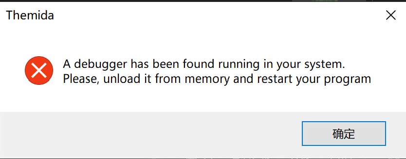
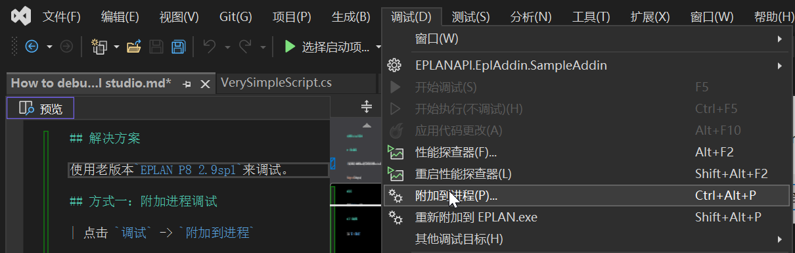
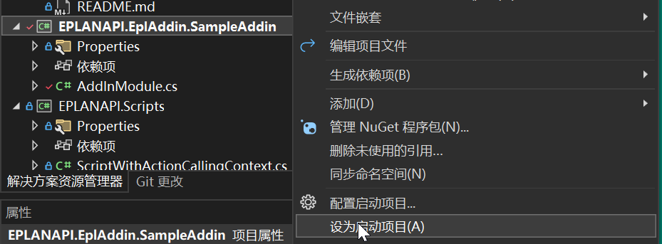
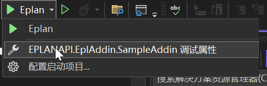
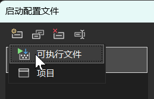
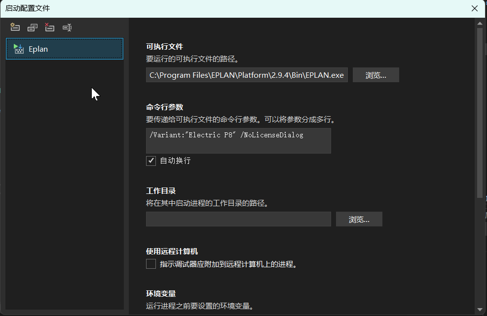

# 如何使用Visual Studio 调试EPLAN

## 一. 使用vs附加调试

> 当前存在的问题， EPLAN使用Themida保护了源代码导致无法使用Visual Studio调试。使用Visual Studio 启动Eplan.exe可以得到此错误。直接附加进程将会导致Eplan重启。

## 解决方案

使用老版本`EPLAN P8 2.9sp1`来调试。

## 方式一：附加进程调试

| 点击 `调试` -> `附加到进程`

## 方式二：直接从`Visual Studio` 配置启动项启动调试

| 1. 选择要调试的项目:`EPLANAPI.EplAddin.SampleAddin`, 右击，设为启动项目。

| 2. 配置调试属性

| 3. 填写调试属性

* 创建可执行文件并重命名为eplan

* 填写参数

可执行文件：`C:\Program Files\EPLAN\Platform\2.9.4\Bin\EPLAN.exe`
命令行参数：`/Variant:"Electric P8" /NoLicenseDialog`

| `F5`启动